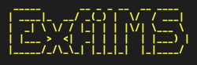

\
[![NPM version][npm-image]][npm-url]
[![build status][ci-image]][ci-url]
[![Test coverage][codecov-image]][codecov-url]
[![npm download][download-image]][download-url]

## Introduction

ExfilMS is a cross-platform, command line interface (CLI) tool to extract mass spectrometry (MS) data from mzML formatted files, with spectrum filtering capabilities.\
<br>

### Features:

- Precision value rounding
- Spectra filtering (m/z and intensity)
  - Targeted (target file, m/z tolerance and ppm tolerance)
  - Range (minimum and maximum m/z)
- Spectrum data filtering
  - Spectrum type (profile / centroid)
  - MS level
  - Polarity (positive / negative)
  - Exclude spectra (m/z and intensity)

<br>

## Installation

> ExfilMS has been tested on Windows, macOS and Linux.

### CLI

> [!IMPORTANT]\
> Prerequisite: [Node.js®][nodejs-url]

`$ npm install -g exfilms`

<br>

### Docker

> [!IMPORTANT]\
> Prerequisite: [Docker][docker-url]

```md
# Clone repository

$ git clone https://github.com/vmalnathnambiar/exfilms.git

# Navigate into repository

$ cd exfilms

# Build Docker image

$ docker build -t exfilms .
```

<br>

## Usage

### CLI

```md
# Using command line arguments

$ exfilms -i "/path/to/input/directory/containing/mzML/data/files/" ...

# Interactive

$ exfilms -x
```

<br>

### Docker

```md
# Using command line arguments

$ docker run --rm -it -v "/path/to/input/directory/":/inputDirectory -v "/path/to/output/directory/":/outputDirectory -v "/path/to/log/directory/":/logDirectory exfilms -i /inputDirectory -o /outputDirectory -l /logDirectory ....

# Interactive

$ docker run --rm -it -v "/path/to/input/directory/":/inputDirectory -v "/path/to/output/directory/":/outputDirectory -v "/path/to/log/directory/":/logDirectory exfilms -x
```

> [!NOTE]\
> Running ExfilMS using Docker requires the use of volume mapping in the Docker command. For example,
>
> `-v "/path/on/the/local/machine/":/tmpPath`
>
> Once the volume mapping is done, you would use /tmpPath as the input data where required, instead of the actual path on the local machine. For the successful execution of ExfilMS, you are **REQUIRED** to provide the following:
>
> - -v "/path/to/input/directory/":/inputDirectory
> - -v "/path/to/output/directory/":/outputDirectory
> - -v "/path/to/log/directory/":/logDirectory

<br>

For more guidance on how to use ExfilMS, please refer to our available guides below:

- [Data Conversion to mzML using ProteoWizard](./docs/data-conversion-to-mzml-using-proteowizard.md)
- [How to ExfilMS: The Complete Guide](./docs/how-to-exfilms-the-complete-guide.md)
- [How to Create A Target File](./docs/how-to-create-a-target-file.md)

<br>

## Limitations

> [!WARNING]
>
> - Unable to output extracted files when running interactive mode with Docker.
> - Unable to parse mzML data that has a file size **GREATER THAN** 2GB.

<br>

## Citations

If you use ExfilMS in your work, please cite it using the following:

<!-- <a id="1">[1]</a> -->

<br>

<!-- ## API Documentation
Please refer to our API documentation [here](https://vmalnathnambiar.github.io/exfilms/). -->

## License

Please refer to our license information [here](./LICENSE).

<!-- URLs used in the markdown document-->

[npm-image]: https://img.shields.io/npm/v/exfilms.svg
[npm-url]: https://www.npmjs.com/package/exfilms
[ci-image]: https://github.com/vmalnathnambiar/exfilms/workflows/Node.js%20CI/badge.svg?branch=main
[ci-url]: https://github.com/vmalnathnambiar/exfilms/actions?query=workflow%3A%22Node.js+CI%22
[codecov-image]: https://img.shields.io/codecov/c/github/vmalnathnambiar/exfilms.svg
[codecov-url]: https://codecov.io/gh/vmalnathnambiar/exfilms
[download-image]: https://img.shields.io/npm/dm/exfilms.svg
[download-url]: https://www.npmjs.com/package/exfilms
[nodejs-url]: https://nodejs.org/en/download/
[docker-url]: https://docs.docker.com/engine/install/
