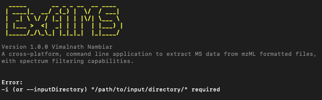

# How to ExfilMS: The Complete Guide

1. [Introduction](#introduction)
2. [Execution of ExfilMS and The Use of Flags](#execution-of-exfilms-and-the-use-of-flags)
3. [Useful Commands](#useful-commands)
   - [General](#general)
   - [Specifying Input Data](#specifying-input-data)
   - [Specifying Outputs](#specifying-outputs)
   - [Dealing with Precision](#dealing-with-precision)
   - [Spectra Filtering](#spectra-filtering)
     - [Targeted m/z Filtering](#method-1---targeted-mz-filtering)
     - [m/z Range Filtering](#method-2---mz-range-filtering)
   - [Spectrum Data Filtering](#spectrum-data-filtering)

<br>

## Introduction

ExfilMS is a cross-platform, command line interface (CLI) tool that allows you to easily extract MS data from mzML formatted files, with spectrum filtering capabilities. This guide will help you understand how to use ExfilMS to its full potential.

> _Note: If you are reading this guide, it is assumed that you have ExfilMS already installed and is available on your device. If it is not installed, please refer to the installation guide [here](../README.md#installation)._

<br>

## Execution of ExfilMS and The Use of Flags

ExfilMS can easily be executed upon installation using your terminal with the command `exfilms`.

However, running this command on its own will result in an error, as seen below.



This is because the `i`, `--inputDirectory` displayed in the error message is referred to as a command line flag (or "flag") that is required a successful execution. There are both required and non-required flags available for your use. The inclusion of these flags along with the `exfilms` command will configure and establish the behaviour of the tool for running its extraction (and filtering) process.  
<br>

## Useful Commands

### General

`--help`

Displays a list of available commands along with their descriptions. This is useful for understanding the purpose of each flag.

```md
# Show help

$ exfilms --help
```

<br>

`--version`

Displays the current version of ExfilMS that is installed on your device. This is useful if you would like to check the version of ExfilMS being executed on your device.

```md
# Show version number

$ exfilms --version
```

<br>

`--interactive`

Runs ExfilMS in interactive mode. This mode will prompt questions on the terminal one-by-one for your input required to configure and execute the extraction (and filtering) process just the way you like.

```md
# Run interactive mode

$ exfilms --interactive
```

<br>

### Specifying Input Data

`-i`, `--inputDirectory` \*_Required_

_Input type: String_

Specify the input directory containing all the mzML data files. This is a required flag for the execution of ExfilMS as it establishes the pathway to the directory of the files to be processed.

```md
# Specify input directory containing mzML data files

$ exfilms -i (or --inputDirectory) "/path/to/input/directory/"
```

<br>

Along with the `-i`, `--inputDirectory` flag, you can also specify specific files within the input directory that you would like to process by simply appending `--fileList` to the command. This flag accepts space-separated strings of file names or "\*" for all files as its value.

_Input type: Space-separated strings_

_Default: "\*"_

```md
# Process all files

$ exfilms -i (or --inputDirectory) "/path/to/input/directory/" --fileList "\*"

# Process specific file(s)

$ exfilms -i (or --inputDirectory) "/path/to/input/directory/" --fileList "file1.mzML" "file2.mzML" "file3.mzML"
```

<br>

### Specifying Outputs

`-f`, `--outputFormat`

_Input type: String_

_Choices: "JSON", "TSV" | Default: "JSON"_

Specify output format. There are currently two available output formats for you to choose from.

1. JSON, also known as JavaScript Object Notation is a standard, human readable text stored in the basis of object key-value pairs.

2. TSV, on the other hand, is an output format in the form of tab separated values.
   > _Note: Due to the characteristics of MS data being n-dimensional, it is a challenge to store all of the extracted data into a single file. If you do choose TSV as your desired output format, two folders will be created in the output directory labelled 'spectrum' and 'chromatogram', containing the associated MS data of the file being processed, respectively._

<br>

```md
# Specify output format

$ exfilms -i "/path/to/input/directory/" -f (or --outputFormat) "JSON"
```

> _Note: This flag only accepts only **ONE** output format for its value at a time._

<br>

`-o`, `--outputDirectory`

_Input type: String_

_Default: /home/dir/exfilms/outputFormat/_

Specify the output directory to store all the generated output files.

```md
# Specify output directory

$ exfilms -i "/path/to/input/directory/" -o (or --outputDirectory) "/path/to/output/directory/"
```

<br>

`-l`, `--logDirectory`

_Input type: String_

_Default: /home/dir/.exfilms/_

Specify the log directory to store the generated log file of the extraction (and filtering) process.

```md
# Specify log directory

$ exfilms -i "/path/to/input/directory/" -l (or --logDirectory) "/path/to/log/directory/"
```

<br>

### Dealing with Precision

`-d`, `--decimalPlace`

_Input type: Number_

_Default: No rounding of precision values_

MS data (i.e., m/z values detected by the instrument) often comes with precision values that contains a long range of decimal places. However, it is found that sometimes while processing MS data, these precision values are represented by a smaller range of decimal places (i.e., 4 decimal places). With this flag, you can determine the number of decimal places that you would like to round the precision values identified to.

```md
# Specify number of decimal places to round precision values to

$ exfilms -i (or --inputDirectory) "/path/to/input/directory/" -d (or --decimalPlace) 4
```

<br>

### Spectra Filtering

ExfilMS also provides you with the capability to filter the spectra (m/z and intensity) acquired during acquisition for each scan point (retention time) via two methods.

> _Note: The spectra filtering options are mutually exclusive. You can only use **ONE** of the method at a time._

<br>

#### Method 1 - Targeted m/z Filtering

`-t`, `--targeted` \*_Required_

<br>

`--targetFile` \*_Required_

_Input type: String_

This method works with the assumption that the m/z values of investigated analytes of interest within a spectra are known to you. To use this method for filtering targeted m/z values within the spectra, you are **REQUIRED** to include the above two flags in the command to be executed. The `-t`, `--targeted` flag indicates to ExfilMS that you would like to perform this method of spectra filtering, whereas the `--targetFile` flag specifies a target file that is locally stored on your device or published to web URL (Should be available in TSV format).

For more info on how to create a target file, please refer [here](./how-to-create-a-target-file.md).

```md
# Targeted m/z filtering

$ exfilms -i (or --inputDirectory) "/path/to/input/directory/" -t (or --targeted) --targetFile "/local/path/or/published/to/web/URL/to/target/tsv/file"
```

<br>

In addition to the required flags, there are two additional flags that can also be configured which sets the m/z and mass accuracy (ppm) tolerance ranges, respectively. These tolerance range will then be used while filtering for the targeted m/z values in the spectra.

`--mzTolerance`

_Input type: Number_

_Default: 0.005_

```md
# Set accepted m/z tolerance

$ exfilms -i (or --inputDirectory) "/path/to/input/directory/" -t (or --targeted) --targetFile "/local/path/or/published/to/web/URL/to/target/tsv/file" --mzTolerance 0.005
```

<br>

`--ppmTolerance`

_Input type: Number_

_Default: 5_

```md
# Set accepted mass accuracy (ppm) tolerance

$ exfilms -i (or --inputDirectory) "/path/to/input/directory/" -t (or --targeted) --targetFile "/local/path/or/published/to/web/URL/to/target/tsv/file" --ppmTolerance 5
```

<br>

#### Method 2 - m/z Range Filtering

`-r`, `--mzRange` \*_Required_

This method is based on range filtering using a minimum (lower bound) and maximum (upper bound) values. This method is for you if you still would like to filter the spectra but do not know the specific m/z values to target for.

```md
# Filter spectra for specific m/z range

$ exfilms -i (or --inputDirectory) "/path/to/input/directory/" -r (or --mzRange)
```

<br>

With the above flag included in the command, you can also specify the minimum and maximum m/z value to be used as the lower and upper boundary.

`--minMZ`

_Input type: Number_

_Default: 0_

```md
# Set minimum m/z

$ exfilms -i (or --inputDirectory) "/path/to/input/directory/" -r (or --mzRange) --minMZ 0
```

<br>

`--maxMZ`

_Input type: Number_

_Default: End of spectra range_

```md
# Set minimum m/z

$ exfilms -i (or --inputDirectory) "/path/to/input/directory/" -r (or --mzRange) --maxMZ 1000
```

<br>

### Spectrum Data Filtering

`-s`, `--filterSpectrumData` \*_Required_

ExfilMS also provides you with the functionality of filtering the spectrum based on its properties such as spectrum type, MS level and polarity. With this flag, you can also decide to exclude the spectra (m/z and intensity array) acquired for each spectrum from being stored in the output file. This spectra exclusion filter is particularly useful if you are interested in analysis only the metadata of each spectrum.

<br>

`--spectrumType`

_Input type: Space-separated strings_

_Choices: "profile", "centroid" | Default: Both spectrum types_

```md
# Filter for specific spectrum type

$ exfilms -i (or --inputDirectory) "/path/to/input/directory/" -s (or --filterSpectrumData) --spectrumType "profile" "centroid"
```

<br>

`--msLevel`

_Input type: Space-separated numbers_

_Default: MS level 1 and 2_

```md
# Filter for specific MS levels

$ exfilms -i (or --inputDirectory) "/path/to/input/directory/" -s (or --filterSpectrumData) --msLevel 1 2
```

<br>

`--polarity`

_Input type: Space-separated strings_

_Choices: "positive", "negative" | Default: Both polarities_

```md
# Filter for specific polarities

$ exfilms -i (or --inputDirectory) "/path/to/input/directory/" -s (or --filterSpectrumData) --polarity "positive" "negative"
```

<br>

`--excludeSpectra`

```md
# Exclude spectra (m/z and intensity values) from output file

$ exfilms -i (or --inputDirectory) "/path/to/input/directory/" -s (or --filterSpectrumData) --excludeSpectra
```

<!-- URLs used in the markdown document-->
