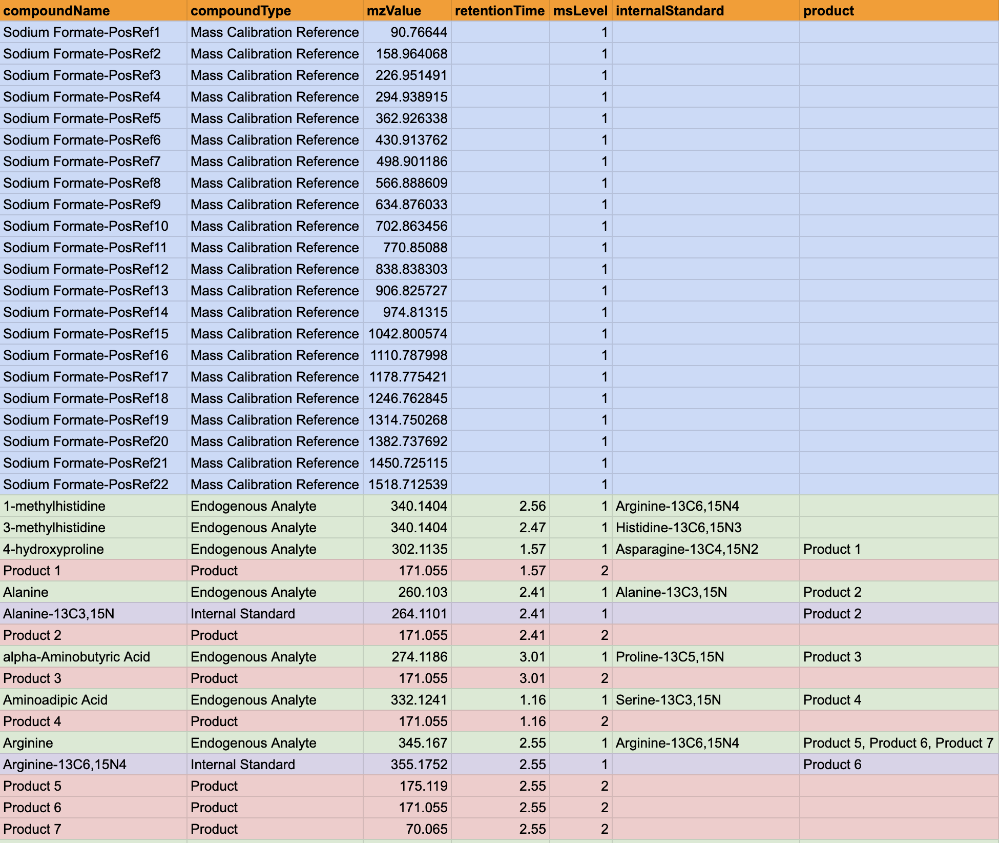
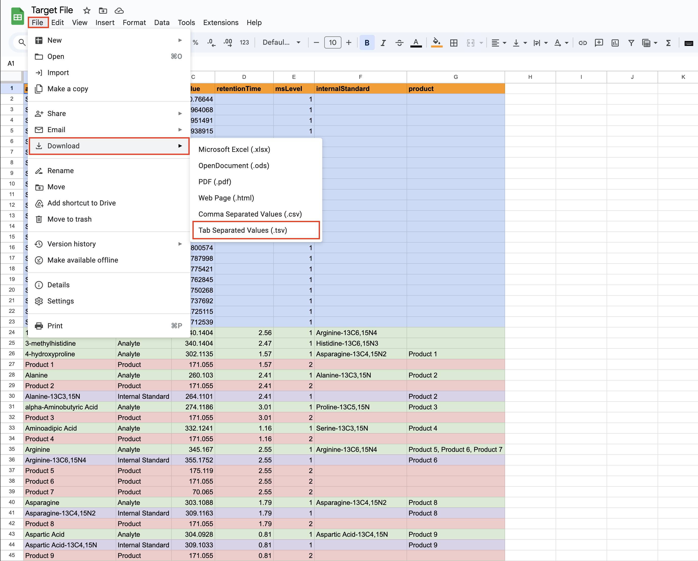
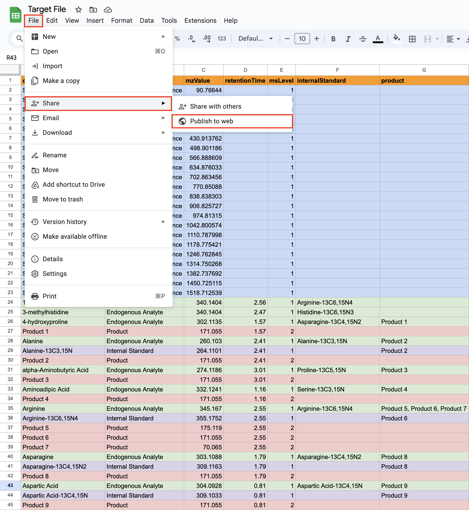
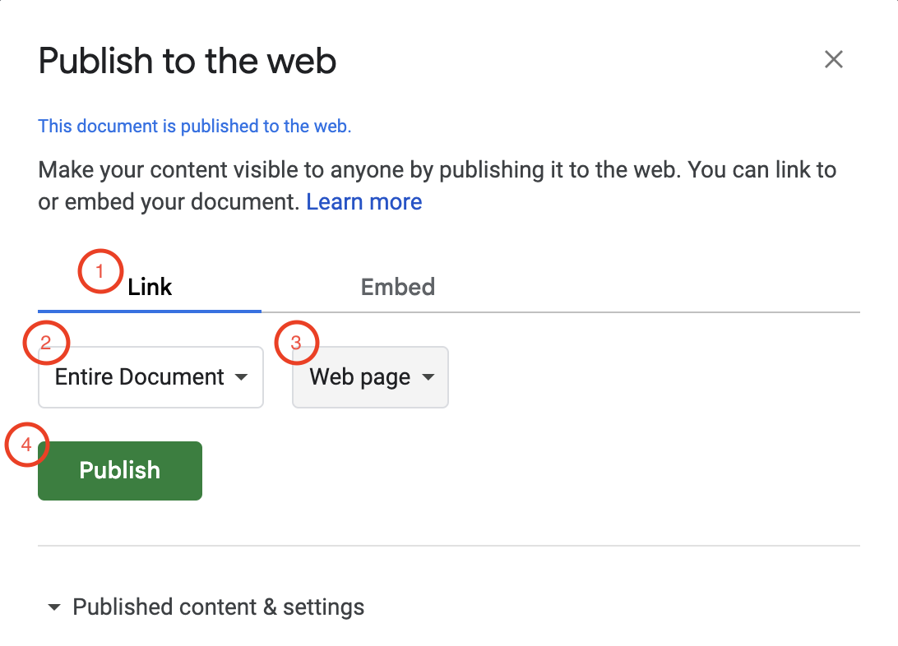

# How to Create A Target File

> [!NOTE]\
> To create the target file, I would highly recommend the use of Google Sheets. This will enable you to easily save and/or publish the sheet to the web as tsv with ease.

### Table of Contents

1. [File Layout](#file-layout)
2. [Save to Local Device](#save-to-local-device)
3. [Publish to Web](#publish-to-web)

 

## File Layout

The targeted m/z filtering method provided by ExfilMS for spectra filtering requires a target file. This target file should consist of the following data:

- Analyte Name
- Analyte Type
- m/z Value
- Retention Time
- MS Level
- Associated Internal Standards
- Associated Products

 

To create this target file, you **MUST** follow the layout shown below.

> [!IMPORTANT]\
> The header names MUST match the headers displayed in the layout.

 

## Save to Local Device

To save the newly created target file as a tsv file to a local path on your device, you can do the following:

`File` > `Download` > `Tab Separated Values (.tsv)`

\
 

## Publish to Web

To publish the newly created target file as a tsv file to the web, you can do the following:

`File` > `Share` > `Publish to web`

Once you select the option, you will be prompted a pop-up box allowing you to specify how you would like to publish your content to the web. You can then use the options provided to link or embed your document.  
 

For the purpose of ExfilMS, you should do the following:

1. Click on Link
2. Choose the sheet that you would like to publish from the dropdown options
3. Choose TSV format from the dropdown options
4. Publish

 

> [!NOTE]\
> Once you publish the sheet, you will be provided a link that you can then use as the input while using the `--targetFile` flag when running the targeted m/z filtering method for spectra filtering.
