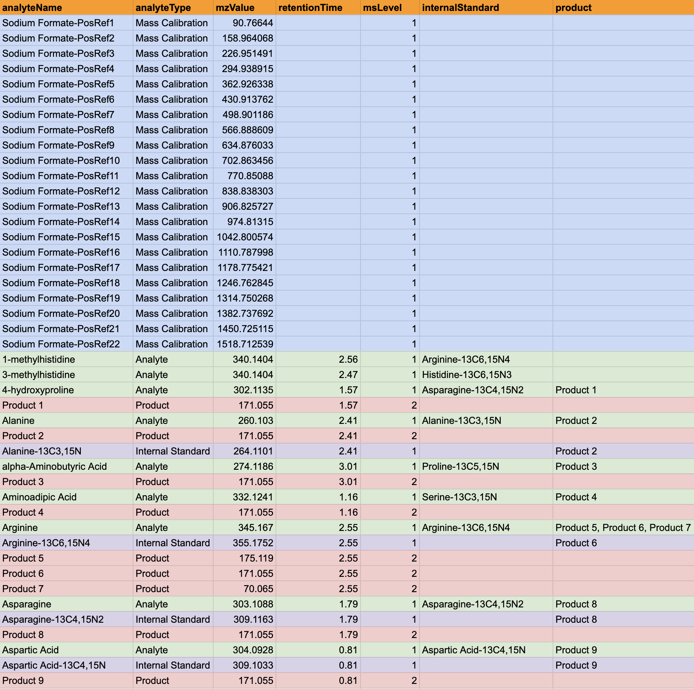

# How to ExfilMS: The Ultimate Guide
> *Note: If you are reading this guide, it is assumed that you have ExfilMS already installed and is available on your machine. If it is not installed, please refer to the installation guide [here](../README.md#installation).*

ExfilMS is a cross-platform, command line application that allows you to easily extract MS data from mzML formatted files into JSON, with spectrum filtering capabilities. This guide will help you understand how to use ExfilMS to its full potential.  
<br>

## The Use of Command Line Flags
ExfilMS can easily be executed upon installation via the terminal with the command `exfilms`. However, running this command on its own will result in an error, as seen below.  

  
> *Note: The `i`, `--inputDirectory` displayed in the error message is referred to as a command line flag (or "flag") that is required for the successful execution of ExfilMS.*

<br><br>

ExfilMS comes with a few flags (both mandatory and non-mandatory) that can be executed along with the `exfilms` command to establish the behaviour of the application and to configure the parameters that will be used for the extraction/filtration process.  

`--help`

This flag will display all the flags available for use when using ExfilMS.

```md
# Show help
$ exfilms --help
```
<br><br>

`--version`

This flag is particularly useful if you would like to check the version of ExfilMS being executed on your machine. 

```md
# Show version number
$ exfilms --version
```  
<br><br>

`--interactive`

This flag enables you to run ExfilMS in interactive mode, where you will be prompted with questions to configure the setup of ExfilMS for its operation.

```md
# Run interactive mode
$ exfilms --interactive
```  
<br><br>

`-i`, `--inputDirectory` **Required*

This flag requires you to specify the input directory containing mzML data files to be processed as its value.

```md
# Specify input directory
$ exfilms -i (or --inputDirectory) "/path/to/input/directory/"
```  
<br>

Along with the above flag, you can also specify specific files within the directory that you would like to process. To do so, simple use `--fileList` followed by a space-separated list of file names as its value.

```md
# Process all files in input directory
$ exfilms -i (or --inputDirectory) "/path/to/input/directory/" --fileList "*"

# Process specific file(s) in input directory
$ exfilms -i (or --inputDirectory) "/path/to/input/directory/" --fileList "file1.mzML" "file2.mzML" "file3.mzML"
```
Default: All files within the specified input directory path will be processed.  
<br><br>

`-o`, `--outputDirectory`

This flag allows you to specify the output directory that should be used to store the generated output files.

```md
# Specify output directory
$ exfilms -i "/path/to/input/directory/" -o (or --outputDirectory) "/path/to/output/directory/"
```
Default: The output directory will be set to `/data/<outputFormat>/` in the home directory of your machine.  
<br><br>

`-l`, `--logDirectory`

This flag allows you to specify the log directory that should be used to store the generated log file.

```md
# Specify log directory
$ exfilms -i "/path/to/input/directory/" -l (or --logDirectory) "/path/to/log/directory/"
```
Default: A hidden folder called `.exfilms` will be created in the home directory of your machine to store the generated log file. A new log file (`log.txt`) will also be created automatically if it is not found in the log directory path.  
<br><br>

`-d`, `--decimalPlace`

MS data (i.e., m/z values detected by the instrument) often comes with precision values that contains a long range of decimal places. However, it is found that some targeted libraries used for processing MS data contains precision values that are represented by a smaller range of decimal places (i.e., 4 decimal places). With this flag, you can determine the number of decimal places that you would like to round the precision values to.

```md
# Specify number of decimal places to round precision values to
$ exfilms -i (or --inputDirectory) "/path/to/input/directory/" -d (or --decimalPlace) <number>
```
Default: The precision values identified in the processed mzML data file and target file (if provided) will not be rounded to a specific number of decimal place.  
<br><br>

### Mass Spectra Filtering
ExfilMS also provides you with the capability to filter the mass spectra (m/z and intensity) acquired during acquisition for each scan point (retention time) via two methods - targeted m/z filtering or m/z range filtering.

> *Note: The mass spectra filtering options are mutually exclusive. You can can only use **ONE** of the method at a time.*

<br>

#### Method 1 - Targeted m/z Filtering
<br>

`-t`, `--targeted` **Required*  

This method is based on targeted m/z filtering, whereby the m/z values for analytes of interest are known. To use this method to filter for targeted m/z values, you are also **REQUIRED** to include the `--targetFile` flag that specifies the locally stored path or published to web URL target file - in tab separated value format (tsv). The target file specified with this flag must contain a list of target m/z values that the user would like to filter their mass spectra data against. The target file specified should be available in tab separated value (tsv) format only.  

```md
# Targeted m/z filtering
$ exfilms -i (or --inputDirectory) "/path/to/input/directory/" -t (or --targeted) --targetFile "/local/path/or/published/to/web/URL/to/target/tsv/file"
```  
<br>

The target file to be used for this method has to follow a specific layout.


The above layout was created using Google Sheets. The use of Google Sheets enable users to easily export or publish the sheet to the web as tsv.  
<br>

In addition to the required flags stated above for this method, the m/z and mass accuracy (ppm) tolerance that should be used during the targeted m/z filtering can be configured using `--mzTolerance` and `--ppmTolerance` respectively. 

```md
# Targeted m/z filtering with user specified m/z and ppm tolerance values
$ exfilms -i (or --inputDirectory) "/path/to/input/directory/" -t (or --targeted) --targetFile "/local/path/or/published/to/web/URL/to/target/tsv/file" --mzTolerance <number> --ppmTolerance <number>
```
Default: The accepted m/z tolerance and ppm tolerance will be set to 0.005 and 5 respectively.  
<br><br>

#### Method 2: m/z Range Filtering
<br>

`-r`, `--mzRange` **Required*  

The second method for mass spectra filtering is based on a range filtering based on a minimum (lower bound) and maximum (upper bound). If you still require to filter the mass spectra but the specific m/z values to filter for is not known, this method is for you. 

```md
# m/z range filtering
$ exfilms -i (or --inputDirectory) "/path/to/input/directory/" -r (or --mzRange) 
```  
<br>

With the above flag included in the command, you can also specify the minimum and maximum m/z value to be used as the lower and upper boundary by including the `--minMZ` and `maxMZ` flags respectively.

```md
# m/z range filtering with specified minimum and maximum m/z value
$ exfilms -i (or --inputDirectory) "/path/to/input/directory/" -r (or --mzRange) --minMZ <number> --maxMZ <number>
```
Default: The minimum and maximum m/z value will be set to 0 and last recorded m/z found in the mass spectra array respectively.*
> *Note: When defining these flags, please ensure that the value defined for `--maxMZ` is greater than that of `--minMZ`.*  

<br><br>

### Spectrum Data Filtering
<br>

`-f`, `--filterSpectrumData` **Required* 

This flag allows you to configure to configure parameters allowing for spectrum data filtering based on spectrum properties such as spectrum type, MS level and polarity. With spectrum data filtering, you can also exclude the mass spectra data found with each spectrum information from being stored in the output file.  

```md
# Filter spectrum data
$ exfilms -i (or --inputDirectory) "/path/to/input/directory/" -f (or --filterSpectrumData) 
```
<br><br>

`--spectrumType`

*Choices: "profile", "centroid"*

This flag allows you to specify the spectrum type of the data to filter for. 

```md
# Filter for profile spectrum type only
$ exfilms -i (or --inputDirectory) "/path/to/input/directory/" -f (or --filterSpectrumData) --spectrumType "profile"

# Filter for centroid spectrum type only
$ exfilms -i (or --inputDirectory) "/path/to/input/directory/" -f (or --filterSpectrumData) --spectrumType "centroid"
```
Default: Spectrum data of both profile and centroid spectrum type will be filtered for.  
<br><br>

`--msLevel`

This flag allows you to specify the MS level(s) of the spectrum data to filter for.

```md
# Filter for specific MS level
$ exfilms -i (or --inputDirectory) "/path/to/input/directory/" -f (or --filterSpectrumData) --msLevel 1 2
```
Default: Spectrum data of MS level 1 and 2 will be filtered for.  
<br><br>

`--polarity`

*Choices: "positive", "negative"*

This flag allows you to specify the polarity of the spectrum data to filter for.

```md
# Filter for positive polarity only
$ exfilms -i (or --inputDirectory) "/path/to/input/directory/" -f (or --filterSpectrumData) --spectrumType "positive"

# Filter for negative polarity only
$ exfilms -i (or --inputDirectory) "/path/to/input/directory/" -f (or --filterSpectrumData) --spectrumType "negative"
```
Default: Spectrum data of both positive and negative polarity will be filtered for.  
<br><br>

`--excludeMzData`

This flag will ensure the exclusion of mass spectra data identified in each spectrum from being written into the output file. This is particularly useful if you are interested in capturing only the metadata of each spectrum.

```md
# Exclude m/z and intensity values from output
$ exfilms -i (or --inputDirectory) "/path/to/input/directory/" -f (or --filterSpectrumData) --excludeMzData
```
Default: The m/z and intensity values identified in each spectrum data will not be excluded.

<!-- URLs used in the markdown document-->
[nodejs-url]: https://nodejs.org/en/download/