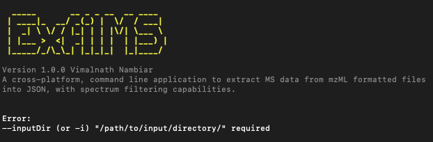

# How to ExfilMS: The Ultimate Guide

> *Note: If you are reading this guide, it is assumed that you have ExfilMS already installed and is available on your machine. If it is not installed, please refer to the installation guide [here](../README.md#installation).*

ExfilMS is a cross-platform, command line application that allows you to easily extract MS data from mzML formatted files into JSON, with spectrum filtering capabilities. This guide will help you understand how to use ExfilMS to its full potential. 

Once ExfilMS has been installed on your local machine, the ExfilMS process can be initiated through the execution of simple, easy-to-use command line prompts upon installation.

Let's begin!

## Command Line Flags

ExfilMS can easily be executed upon installation with the command `exfilms`. However, running this command on its own will result in an error, as seen below. The `--inputDir` or `-i` (to be discussed later) displayed in the error message is referred to as a command line flag that is required for the successful execution of the `exfilms` command.



ExfilMS comes with a few command flags (both mandatory and non-mandatory) that can be executed along with the `exfilms` command to establish the behaviour of the application and configure the parameters to be used for the extraction/filtration of MS data. 

Now, let's go through the flags available to be used with exfilMS. 

<br> **`--help`**

Show help. 

This command will display all of the options and arguments you can use when launching ExfilMS in the terminal.

```md
# Show help
$ exfilms --help
```

<br> **`--version`**

Show version number. 

This command will display the current version of ExfilMS. This is useful if you want to check whether you are running the latest version or not.

```md
# Show version number
$ exfilms --version
```

<br> **`--interactive`**

Run interactive mode. 

In this mode, you will be prompted for input allowing for more control over the configuration of ExfilMS to run its operation. 

```md
# Run interactive mode
$ exfilms --interactive
```

<br> **`-i`, `--inputDir`** **Required*

Specify input directory containing mzML data files. 

This flag **SHOULD ALWAYS** be provided when using `exfilms`. If no value is specified, an error message will be prompted.

```md
# Specify input directory
$ exfilms -i (or --inputDir) "/path/to/input/directory/" 
```

Users can also specify a specific list of files to process from by including a secondary command line flag `--fileList` with a space-separated list of file names as its value.

```md
# Process all files in input directory
$ exfilms -i (or --inputDir) "/path/to/input/directory/" --fileList "*"

# Process specific file(s) in input directory
$ exfilms -i (or --inputDir) "/path/to/input/directory/" --fileList "file1.mzML" "file2.mzML" "file3.mzML"
```

*Default: All files within the specified input directory path will be processed for the ExfilMS operation.*

<br> **`-o`, `--outputDir`**

Specify output directory. 

The specified path will be used to store the generated output files from the ExfilMS operation.

```md
# Specify output directory
$ exfilms -i "/path/to/input/directory/" -o (or --outputDir) "/path/to/output/directory/"
```

*Default: The output directory will be set to `/data/JSON/` in the home directory of the user if not specified.*

<br> **`-l`, `--logDir`**

Specify log directory.

The specified path will store the log file generated during the ExfilMS operation.

```md
# Specify log directory
$ exfilms -i "/path/to/input/directory/" -l (or --logDir) "/path/to/log/directory/"
```

*Default: ExfilMS will create a hidden folder called `.exfilms` in the home directory oft he user to store the generated log file. A new log file (`exfilms_log.txt`) will be created automatically if it is not found in the log directory path.*

<br> **`-d`, `--decimalPlace`**

Specify number of decimal places to round precision values to. 

MS data (i.e., m/z values detected by the instrument) often comes with precision values that contain a long range of decimal places. However, it is found that some targeted libraries used for processing MS data contains precision values that are represented by a smaller range of decimal places (i.e., 4 decimal places). This command flag will allow users to round precision values to the desired number of decimal places during the ExfilMS operation. 

```md
# Specify number of decimal places to round precision values to
$ exfilms -i (or --inputDir) "/path/to/input/directory/" -d (or --decimalPlace) <number>
```

*Default: ExfilMS will not round and will maintain the exact number of decimal places for the precision values identified in the processed mzML data file.*

<!-- URLs used in the markdown document-->
[nodejs-url]: https://nodejs.org/en/download/