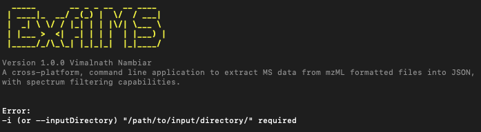

# How to ExfilMS: The Ultimate Guide

> *Note: If you are reading this guide, it is assumed that you have ExfilMS already installed and is available on your machine. If it is not installed, please refer to the installation guide [here](../README.md#installation).*

ExfilMS is a cross-platform, command line application that allows you to easily extract MS data from mzML formatted files into JSON, with spectrum filtering capabilities. This guide will help you understand how to use ExfilMS to its full potential.

## The Use of Command Line Flags

ExfilMS can easily be executed upon installation via the terminal with the command `exfilms`. However, running this command on its own will result in an error, as seen below. The `i`, `--inputDir` displayed in the error message (as seen in the image below and will be discussed later in this guide) is referred to as a command line flag (or "flag") that is required for the successful execution of the `exfilms` command.



ExfilMS comes with a few command line flags (both mandatory and non-mandatory) that can be executed along with the `exfilms` command to establish the behaviour of the application and configure the parameters to be used for the extraction/filtration of MS data.

Now, let's go through the flags available to be used with exfilMS.

<br> **`--help`**

Show help.

This command will display all of the options and arguments you can use when launching ExfilMS in the terminal.

```md
# Show help
$ exfilms --help
```

<br> **`--version`**

Show version number.

This command will display the current version of ExfilMS. This is useful if you want to check whether you are running the latest version or not.

```md
# Show version number
$ exfilms --version
```

<br> **`--interactive`**

Run interactive mode.

In this mode, you will be prompted for input allowing for more control over the configuration of ExfilMS to run its operation.

```md
# Run interactive mode
$ exfilms --interactive
```

<br> **`-i`, `--inputDirectory`** **Required*

Specify input directory containing mzML data files.

This flag **SHOULD ALWAYS** be provided when using `exfilms`. If no value is specified, an error message will be prompted.

```md
# Specify input directory
$ exfilms -i (or --inputDirectory) "/path/to/input/directory/"
```

<br>

Users can also specify a specific list of files to process by including a secondary flag `--fileList` with a space-separated list of file names as its value.

```md
# Process all files in input directory
$ exfilms -i (or --inputDirectory) "/path/to/input/directory/" --fileList "*"

# Process specific file(s) in input directory
$ exfilms -i (or --inputDirectory) "/path/to/input/directory/" --fileList "file1.mzML" "file2.mzML" "file3.mzML"
```
*Default: All files within the specified input directory path will be processed for the ExfilMS operation.*

<br> **`-o`, `--outputDirectory`**

Specify output directory.

The specified path will be used to store the generated output files from the ExfilMS operation.

```md
# Specify output directory
$ exfilms -i "/path/to/input/directory/" -o (or --outputDirectory) "/path/to/output/directory/"
```
*Default: The output directory will be set to `/data/JSON/` in the home directory of the user if not specified.*

<br> **`-l`, `--logDirectory`**

Specify log directory.

The specified path will store the log file generated during the ExfilMS operation.

```md
# Specify log directory
$ exfilms -i "/path/to/input/directory/" -l (or --logDirectory) "/path/to/log/directory/"
```
*Default: ExfilMS will create a hidden folder called `.exfilms` in the home directory oft he user to store the generated log file. A new log file (`exfilms_log.txt`) will be created automatically if it is not found in the log directory path.*

<br> **`-d`, `--decimalPlace`**

Specify number of decimal places to round precision values to.

MS data (i.e., m/z values detected by the instrument) often comes with precision values that contain a long range of decimal places. However, it is found that some targeted libraries used for processing MS data contains precision values that are represented by a smaller range of decimal places (i.e., 4 decimal places). This flag allows users to round precision values to the desired number of decimal places during the ExfilMS operation.

```md
# Specify number of decimal places to round precision values to
$ exfilms -i (or --inputDirectory) "/path/to/input/directory/" -d (or --decimalPlace) <number>
```
*Default: ExfilMS will not round and will maintain the exact number of decimal places for the precision values identified in the processed mzML data file and target file (if provided).*

<br>

### Mass Spectra Filtering

ExfilMS provides user with the capability to filter the mass spectra (m/z and intensity) acquired during acquisition for each scan point (retention time) via two methods - targeted m/z filtering or m/z range filtering.

> *Note: The mass spectra filtering options are mutually exclusive. Users can can only use **ONE** of the method at a time.*

<br>

#### Method 1: Targeted m/z Filtering

The first method is based on targeted filtering whereby the m/z values for analytes of interest are known to the user. To use this targeted filtering method of the mass spectra, there are a few important flags to note:

<br> **`-t`, `--targeted`** *\*Required*

Filter for targeted m/z values.

<br> **`--targetFile`** *\*Required*

Specify target file (locally stored path or published to web URL - tsv file).

The target file specified with this flag must contain a list of target m/z values that the user would like to filter their mass spectra data against. The target file specified should be available in tab separated value (tsv) format only.

As of now, the target file follows a specific layout which can be seen below.


> *Note: The above layout was created using Google Sheets. The use of Google Sheets enable users to easily export or publish the sheet to the web as tsv.*

<br> **`--mzTolerance`**

Set accepted m/z tolerance.

<br>**`--ppmTolerance`**

Set accepted mass accuracy (ppm) tolerance.

<br>

```md
# Targeted m/z filtering using default m/z and ppm tolerance values
$ exfilms -i (or --inputDirectory) "/path/to/input/directory/" -t (or --targeted) --targetFile "/local/path/or/published/to/web/URL/to/target/tsv/file"

# Targeted m/z filtering with user specified m/z and ppm tolerance values
$ exfilms -i (or --inputDirectory) "/path/to/input/directory/" -t (or --targeted) --targetFile "/local/path/or/published/to/web/URL/to/target/tsv/file" --mzTolerance <number> --ppmTolerance <number>
```
*Default: ExfilMS will set the accepted m/z tolerance and ppm tolerance to 0.005 and 5 respectively, if the associated flags are not defined.* 

<br>

#### Method 2: m/z Range Filtering

For users who would like to filter the mass spectra acquired but do not know the specific m/z values to filter for, the second method allows users to filter the mass spectra based on a specific range of m/z values. To configure ExfilMS for this filter is simple - Users would need to include the following flags in the command:

<br> **`-r`, `--mzRange`** *\*Required*

Filter for specific m/z range.

<br> **`--minMZ`**

Set minimum m/z value.

<br> **`--maxMZ`**

Set maximum m/z value.

<br>

```md
# m/z range filtering
$ exfilms -i (or --inputDirectory) "/path/to/input/directory/" -r (or --mzRange) --minMZ <number> --maxMZ <number>
```
> *Note: If both `--minMZ` and `--maxMZ` is defined, please ensure that the maxMZ value is  greater than minMZ value. Otherwise, an error will be reported.*

*Default: ExfilMS will set the minimum and maximum m/z value to 0 and last recorded m/z in the array respectively, if the associated flags are not defined.*

<br>

### Spectrum Data Filtering

Users also have the options to configure parameters that will assist ExfilMS in filtering spectrum data stored within the mzML files being process. To perform spectrum data filtering, users can simply include the following flag in the command

<br> **`-f`, `--filterSpectrumData`**  *\*Required*

Filter spectrum data based on type, MS level and polarity, and/or exclude m/z data.

<br>Once the above flag has been declared, the following flags can be used to filter for different criterias:

**`--spectrumType`**

Specify spectrum type to filter for.

> *Choices: "profile", "centroid"*

```md
# Filter for profile spectrum type only
$ exfilms -i (or --inputDirectory) "/path/to/input/directory/" -f (or --filterSpectrumData) --spectrumType "profile"

# Filter for centroid spectrum type only
$ exfilms -i (or --inputDirectory) "/path/to/input/directory/" -f (or --filterSpectrumData) --spectrumType "centroid"
```
*Default: ExfilMS will filter for both profile and centroid spectrum type if this flag is not defined when `-f`, `--filterSpectrumData` is used.*

<br> **`--msLevel`**

Specify MS level(s) to filter for.

```md
# Filter for specific MS level
$ exfilms -i (or --inputDirectory) "/path/to/input/directory/" -f (or --filterSpectrumData) --msLevel 1
```
> *To filter for more than one MS level, user can input space-separated numbers as values for this flag.*

*Default: ExfilMS will filter for MS level 1 and 2 if this flag is not defined when `-f`, `--filterSpectrumData` is used.*

<br> **`--polarity`**

Specify polarity to filter for.

> *Choices: "positive", "negative"*

```md
# Filter for positive polarity only
$ exfilms -i (or --inputDirectory) "/path/to/input/directory/" -f (or --filterSpectrumData) --spectrumType "positive"

# Filter for negative polarity only
$ exfilms -i (or --inputDirectory) "/path/to/input/directory/" -f (or --filterSpectrumData) --spectrumType "negative"
```
*Default: ExfilMS will filter for both positive and negative polarity if this flag is not defined when `-f`, `--filterSpectrumData` is used.*

<br> **`--excludeMzData`**

Exclude m/z and intensity values from the output. 

This flag is particularly useful for users who are only interested in the metadata of the mass spectra at each retention time.

```md
# Exclude m/z and intensity values from output
$ exfilms -i (or --inputDirectory) "/path/to/input/directory/" -f (or --filterSpectrumData) --excludeMzData
```
*Default: ExfilMS will not exclude m/z and intensity values from output if this flag is not defined when `-f`, `--filterSpectrumData` is used.*

<!-- URLs used in the markdown document-->
[nodejs-url]: https://nodejs.org/en/download/